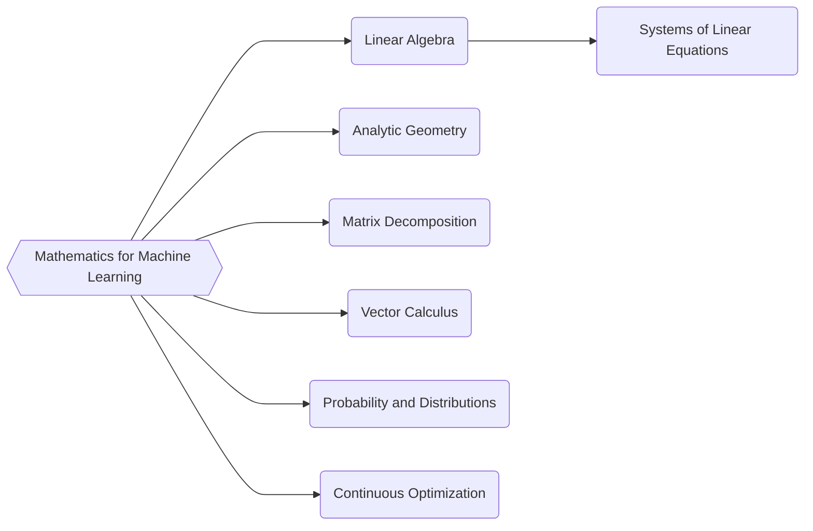

```mermaid
flowchart LR
    A{{Mathematics for Machine Learning}} ---> B(Linear Algebra)
    A ---> C(Analytic Geometry)
    A ---> D(Matrix Decomposition)
    A ---> E(Vector Calculus)
    A ---> F(Probability and Distributions)
    A ---> G(Continuous Optimization)
    B ---> B2(Systems of Linear Equations)
```
