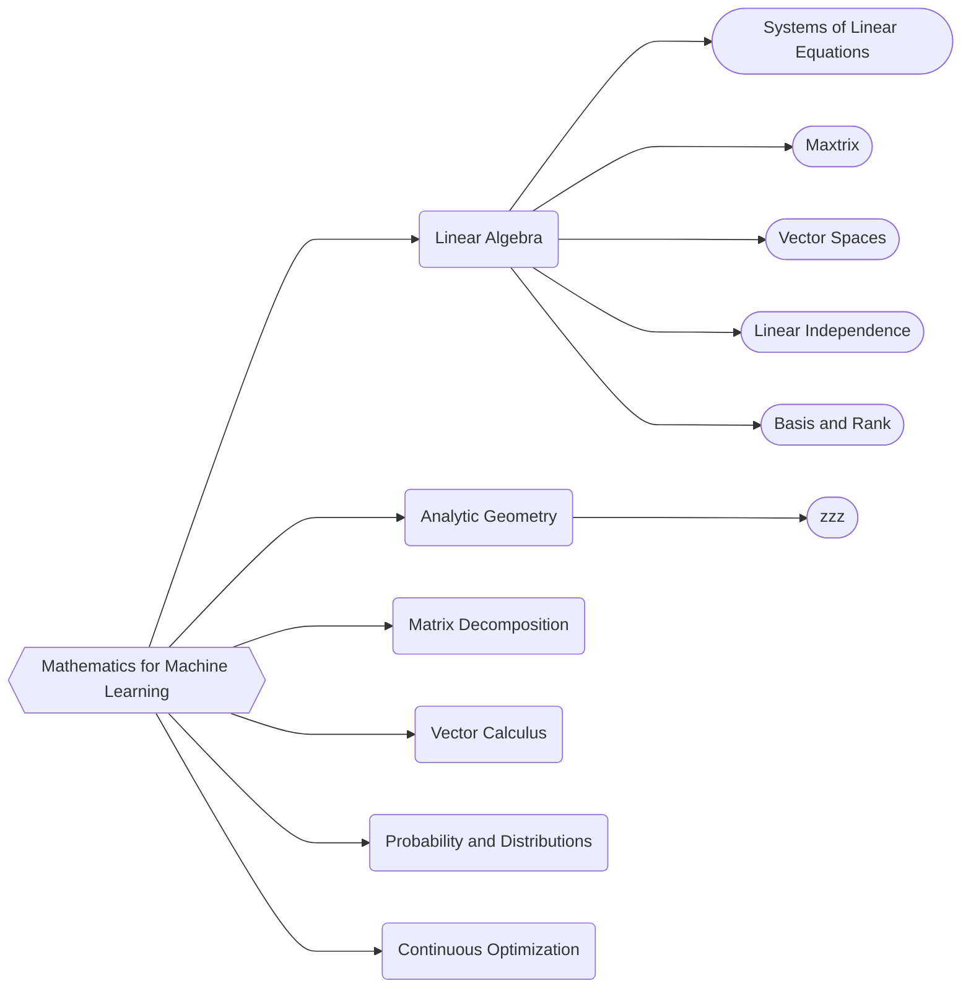

```mermaid
flowchart LR
    A{{Mathematics for Machine Learning}} ---> B(Linear Algebra)
    A ---> C(Analytic Geometry)
    A ---> D(Matrix Decomposition)
    A ---> E(Vector Calculus)
    A ---> F(Probability and Distributions)
    A ---> G(Continuous Optimization)
    B ---> B1([Systems of Linear Equations])
    B ---> B2([Maxtrix])
    B ---> B3([Vector Spaces])
    B ---> B4([Linear Independence])
    B ---> B5([Basis and Rank])
    C ---> C1([zzz])
```
