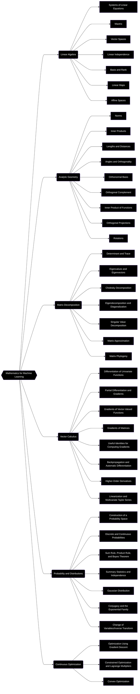

```mermaid
flowchart LR
    classDef bw color: #FFFFFF, fill: #000000
    A{{Mathematics for Machine Learning}}:::bw ---> B(Linear Algebra):::bw
    A ---> C(Analytic Geometry):::bw
    A ---> D(Matrix Decomposition):::bw
    A ---> E(Vector Calculus):::bw
    A ---> F(Probability and Distributions):::bw
    A ---> G(Continuous Optimization):::bw
    B ---> B1[Systems of Linear Equations]:::bw
    B ---> B2[Maxtrix]:::bw
    B ---> B3[Vector Spaces]:::bw
    B ---> B4[Linear Independence]:::bw
    B ---> B5[Basis and Rank]:::bw
    B ---> B6[Linear Maps]:::bw
    B ---> B7[Affine Spaces]:::bw
    C ---> C1[Norms]:::bw
    C ---> C2[Inner Products]:::bw
    C ---> C3[Lengths and Distances]:::bw
    C ---> C4[Angles and Orthogonality]:::bw
    C ---> C5[Orthonormal Basis]:::bw
    C ---> C6[Orthogonal Complement]:::bw
    C ---> C7[Inner Product of Functions]:::bw
    C ---> C8[Orthogonal Projections]:::bw
    C ---> C9[Rotations]:::bw
    D ---> D1[Determinant and Trace]:::bw
    D ---> D2[Eigenvalues and Eigenvectors]:::bw
    D ---> D3[Cholesky Decomposition]:::bw
    D ---> D4[Eigendecomposition and Diagonalization]:::bw
    D ---> D5[Singular Value Decomposition]:::bw
    D ---> D6[Matrix Approximation]:::bw
    D ---> D7[Matrix Phylogeny]:::bw
    E ---> E1[Differentiation of Univariate Functions]:::bw
    E ---> E2[Partial Differentiation and Gradients]:::bw
    E ---> E3[Gradients of Vector-Valued Functions]:::bw
    E ---> E4[Gradients of Matrices]:::bw
    E ---> E5[Useful Identities for Computing Gradients]:::bw
    E ---> E6[Backpropagation and Automatic Differentiation]:::bw
    E ---> E7[Higher-Order Derivatives]:::bw
    E ---> E8[Linearization and Multivariate Taylor Series]:::bw
    F ---> F1[Construction of a Probability Space]:::bw
    F ---> F2[Discrete and Continuous Probabilities]:::bw
    F ---> F3[Sum Rule, Product Rule, and Bayes Theorem]:::bw
    F ---> F4[Summary Statistics and Independence]:::bw
    F ---> F5[Gaussian Distribution]:::bw
    F ---> F6[Conjugacy and the Exponential Family]:::bw
    F ---> F7[Change of Variables/Inverse Transform]:::bw
    G ---> G1[Optimization Using Gradient Descent]:::bw
    G ---> G2[Constrained Optimization and Lagrange Multipliers]:::bw
    G ---> G3[Convex Optimization]:::bw
```
