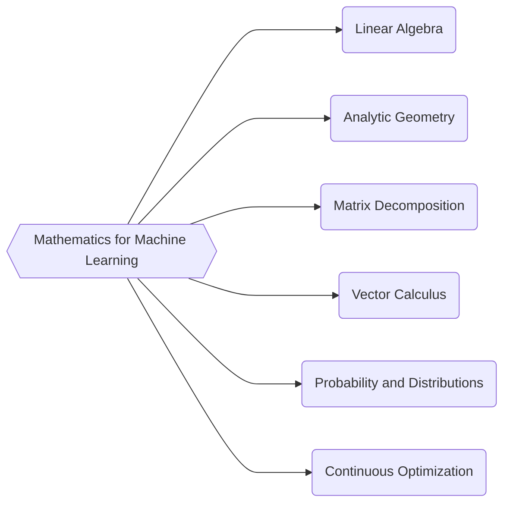

```mermaid
flowchart LR
    1{{Mathematics for Machine Learning}} ---> 2(Linear Algebra)
    1 ---> 3(Analytic Geometry)
    1 ---> 4(Matrix Decomposition)
    1 ---> 5(Vector Calculus)
    1 ---> 6(Probability and Distributions)
    1 ---> 7(Continuous Optimization)
```
